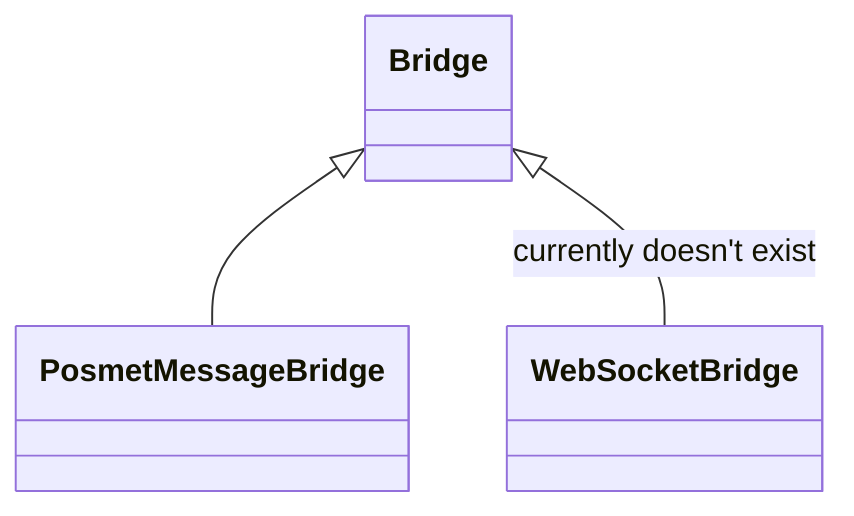
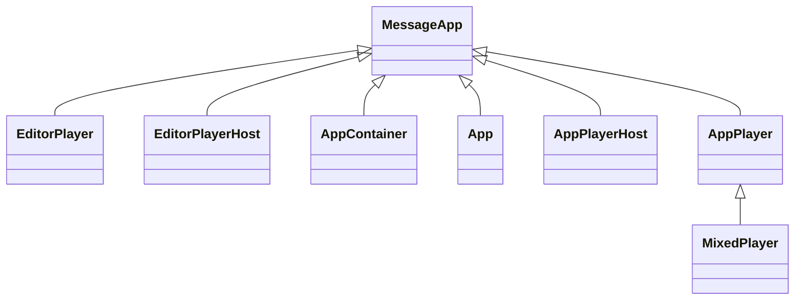

# @screencloud/app-core

## Install

This package is published using semantic-release and available on npm.

To install run

```bash
npm install @screencloud/app-core --save
```

## Usage

This package offers base classes to establish easy communication via any channel which can relay strings to another party.

For this `Bridge`- and `MessageApp`-classes offer basic functionality and `PostMessageBridge` offers an implementation via
`message`-events between iframes and their parent or top windows.

While all classes can be used directly it's recommended to put the into a fully typed scope as done in [@screencloud/app](https://github.com/screencloud/app).

`PostMessageBridge` is currently the only used implementation of `Bridge`, but there could later be a e.g., `WebSocketBridge` implementation.



Meanwhile `MessageApp` is extended by the following classes in [@screencloud/app](https://github.com/screencloud/app).


