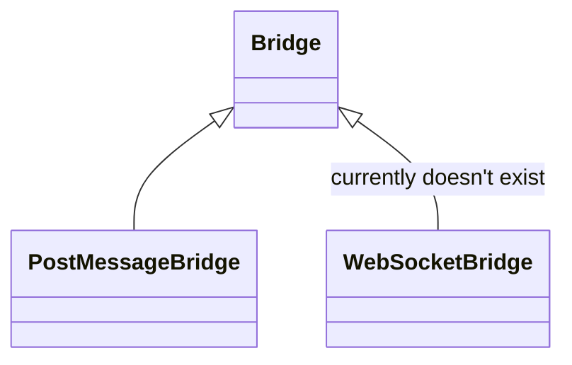
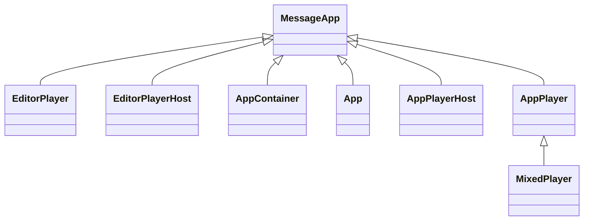

# @screencloud/app-core

## Install

This package is published using semantic-release and available on npm.

To install run

```bash
npm install @screencloud/app-core --save
```

## Usage

This package offers base classes to establish easy communication via any channel which can relay strings to another party.

For this `Bridge`- and `MessageApp`-classes offer basic functionality and `PostMessageBridge` offers an implementation via
`message`-events between iframes and their parent or top windows.

While all classes can be used directly it's recommended to put the into a fully typed scope as done in [@screencloud/app](https://github.com/screencloud/app).

`PostMessageBridge` is currently the only used implementation of `Bridge`, but there could later be a e.g., `WebSocketBridge` implementation.


[](https://mermaid-js.github.io/mermaid-live-editor/#/edit/eyJjb2RlIjoiY2xhc3NEaWFncmFtXG4gICAgQnJpZGdlIDx8LS0gUG9zdE1lc3NhZ2VCcmlkZ2VcbiAgICBCcmlkZ2UgPHwtLSBXZWJTb2NrZXRCcmlkZ2UgOiBjdXJyZW50bHkgZG9lc24ndCBleGlzdFxuIiwibWVybWFpZCI6eyJ0aGVtZSI6ImRlZmF1bHQifX0)

Meanwhile `MessageApp` is extended by the following classes in [@screencloud/app](https://github.com/screencloud/app).



[](https://mermaid-js.github.io/mermaid-live-editor/#/edit/eyJjb2RlIjoiY2xhc3NEaWFncmFtXG4gICAgTWVzc2FnZUFwcCA8fC0tIEVkaXRvclBsYXllclxuICAgIE1lc3NhZ2VBcHAgPHwtLSBFZGl0b3JQbGF5ZXJIb3N0XG4gICAgTWVzc2FnZUFwcCA8fC0tIEFwcENvbnRhaW5lclxuICAgIE1lc3NhZ2VBcHAgPHwtLSBBcHBcblxuICAgIE1lc3NhZ2VBcHAgPHwtLSBBcHBQbGF5ZXJIb3N0XG4gICAgTWVzc2FnZUFwcCA8fC0tIEFwcFBsYXllclxuICAgIEFwcFBsYXllciA8fC0tIE1peGVkUGxheWVyXG4iLCJtZXJtYWlkIjp7InRoZW1lIjoiZGVmYXVsdCJ9fQ)
