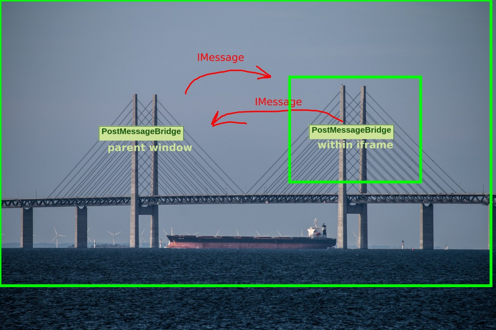
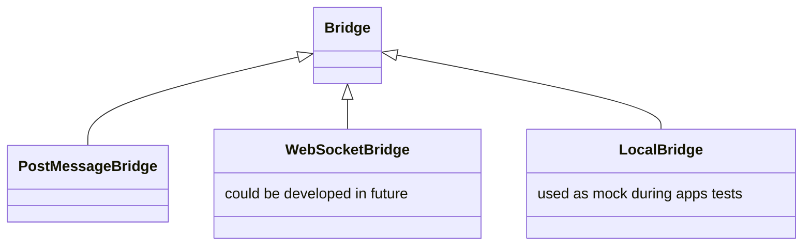
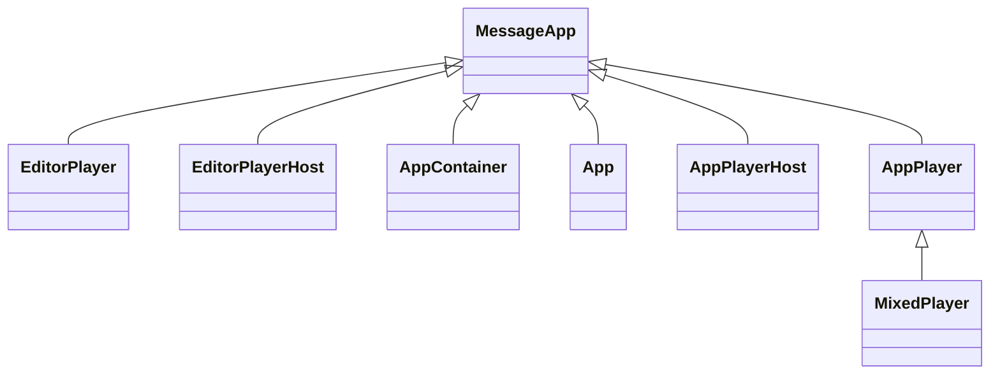

# @screencloud/app-core

## Install

This package is published using semantic-release and available on npm.

To install run

```bash
npm install @screencloud/app-core --save
```

## Usage

This package offers base classes to establish easy communication via any channel which can relay strings to another party.

For this `Bridge`- and `MessageApp`-classes offer basic functionality and `PostMessageBridge` offers an implementation via
`message`-events between iframes and their parent or top windows.

While all classes can be used directly it's recommended to put the into a fully typed scope as done in [@screencloud/app](https://github.com/screencloud/app).

### PostMessageBridge

`PostMessageBridge` is currently the only used implementation of `Bridge`, but there could later be an e.g., `WebSocketBridge` implementation. `Bridge` itself is basically an abstract class, though the code doesn't reflect that.

Bridge is a bit of a misnomer, as you really need two Bridges to send messages. So you can think of it as more like one of the pillars of a suspension bridge, passing messages back and forth.





[](https://mermaid-js.github.io/mermaid-live-editor/#/edit/eyJjb2RlIjoiY2xhc3NEaWFncmFtXG4gICAgQnJpZGdlIDx8LS0gUG9zdE1lc3NhZ2VCcmlkZ2VcbiAgICBCcmlkZ2UgPHwtLSBXZWJTb2NrZXRCcmlkZ2VcbiAgICBCcmlkZ2UgPHwtLSBMb2NhbEJyaWRnZVxuICAgIExvY2FsQnJpZGdlIDogdXNlZCBhcyBtb2NrIGR1cmluZyBhcHBzIHRlc3RzXG4gICAgV2ViU29ja2V0QnJpZGdlIDogY291bGQgYmUgZGV2ZWxvcGVkIGluIGZ1dHVyZVxuIiwibWVybWFpZCI6eyJ0aGVtZSI6ImZvcmVzdCJ9fQ)

There is also a number of `LocalBridge` implementations defined in the apps repo: [@screencloud/apps](https://github.com/screencloud/apps) as a way to mock a `PostMessageBridge` during tests. They are used as an easier way to work around creating `iframes` in tests, since they can just be injected as a replacement for the default `PostMessageBridge`. A basic version looks like this:

``` javascript
class LocalBridge {
  isConnected = true;
  isConnecting = false;

  connect() {
    return Promise.resolve();
  }

  disconnect() {
    return Promise.resolve();
  }

  send(bridgeMessage) {
    console.log(`Local Bridge - Send`, bridgeMessage);
  }

  request(message) {
    console.log(`Local Bridge - Request`, message);
    return Promise.resolve();
  }
}
```
classDiagram
    Bridge <|-- PostMessageBridge
    Bridge <|-- WebSocketBridge
    Bridge <|-- LocalBridge
    LocalBridge : used as mock during apps tests
    WebSocketBridge : could be developed in future

PostMessageBridge is intended to be as dumb as possible, and thus is quite loosely typed. All of the type checking happens on the actual messages themselves, in the classes that inherit from `MessageApp`


### MessageApp

Meanwhile `MessageApp` is extended by the following classes in [@screencloud/app](https://github.com/screencloud/app).



[](https://mermaid-js.github.io/mermaid-live-editor/#/edit/eyJjb2RlIjoiY2xhc3NEaWFncmFtXG4gICAgTWVzc2FnZUFwcCA8fC0tIEVkaXRvclBsYXllclxuICAgIE1lc3NhZ2VBcHAgPHwtLSBFZGl0b3JQbGF5ZXJIb3N0XG4gICAgTWVzc2FnZUFwcCA8fC0tIEFwcENvbnRhaW5lclxuICAgIE1lc3NhZ2VBcHAgPHwtLSBBcHBcblxuICAgIE1lc3NhZ2VBcHAgPHwtLSBBcHBQbGF5ZXJIb3N0XG4gICAgTWVzc2FnZUFwcCA8fC0tIEFwcFBsYXllclxuICAgIEFwcFBsYXllciA8fC0tIE1peGVkUGxheWVyXG4iLCJtZXJtYWlkIjp7InRoZW1lIjoiZm9yZXN0In19)
